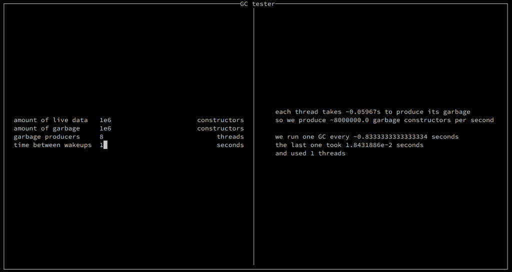

# GC Tester

Run using `cabal run gc-tester -- +RTS -T`.

Move between fields using `<TAB>` and `<Shift+TAB>`.

Each thread produces the specified amount of garbage every time they wake up.

Exit using `<ESC>`.
